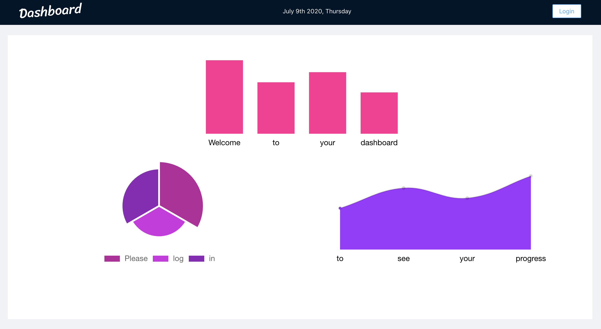
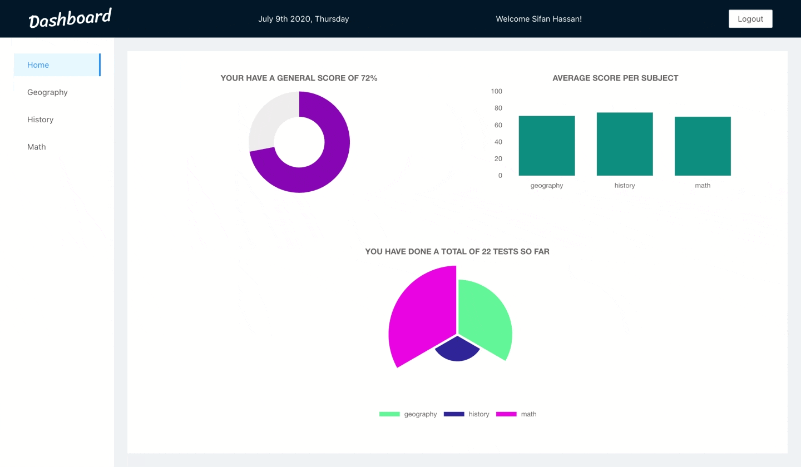
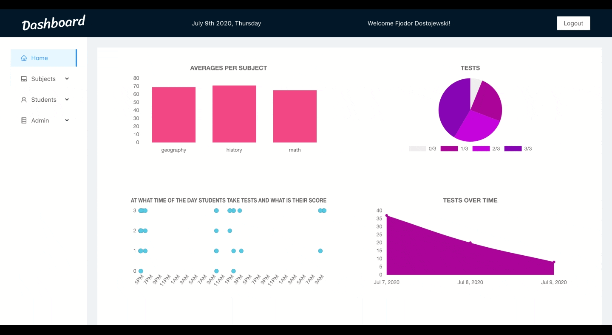

# School-Dashboard

## What is this?

This is a dashboard where students and teachers can keep track of grades and progress for multiple subjects/students. For the details on the functionality see the [user stories](#userStories).

## Table of contents

- [App demos](#appDemos)
- [Tech-Stack](#techStack)
- [User stories](#userStories)
- [Server repository](#serverRepo)

## App demos

## Technologies

### Front-end

- ~~JavaScript~~ TypeScript
- React
- ~~Redux~~ React-Query
- Chart.js
- Ant Design

### Back-end

- ~~JavaScript~~ TypeScript
- ~~Sequelize~~ Prisma
- PostgreSQL
- Express

## User stories

### As a student ...

- As a student I want to sign up/login in order to use the dashboard and see my grades/progress.
- When logged in I will see an overview (sidebar) of the classes I am attending.
- On the main page I will see a chart with my average grade for each subject.
  -By clicking on a subject in the sidebar I will see an overview of all my scores (per test) for that subject.
- On this details page there is a button to do a test for that subject.
- I will see a 'finish test' button, and get a display of a message with the result.

### As a teacher ...

- As a teacher I want to sign up/login in order to use the dashboard and see my student details.
- When logged in, I will get an overview with all my students and subjects that I am teaching (sidebar).
- On the main page I will see a chart with the average grade for the subjects.
- I can use the links in the sidebar to see the details for a student, or subject.
- I can click a link in the sidebar to see the list of existing mc questions for a subject and add a mc question.
- As a teacher I can add a subject

## Server repository

The repository for the backend can be found [here](https://github.com/willemverbuyst/school-dashboard-backend).

This is a REST-ful API using Express.js.

The database is built using Postgres and ~~Sequelize~~ Prisma.
